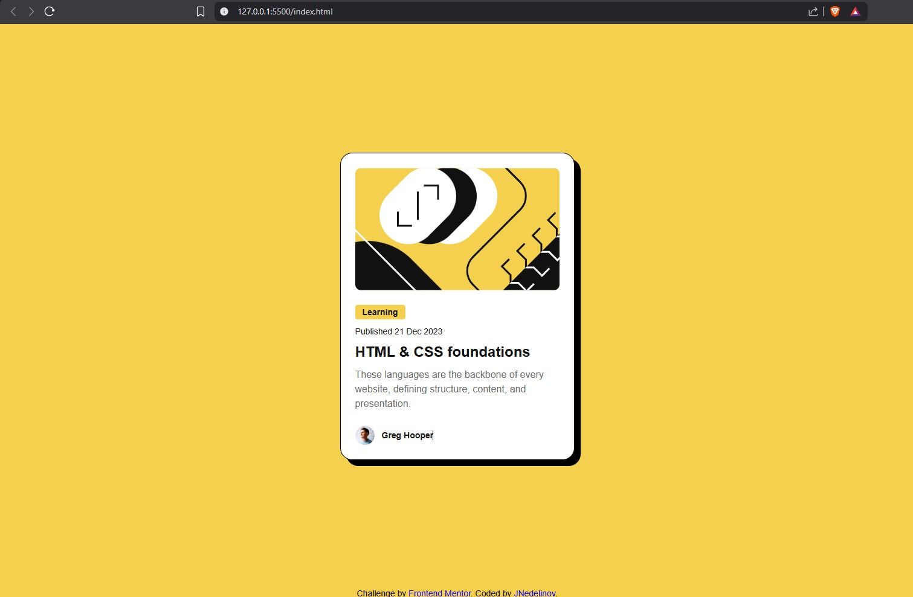
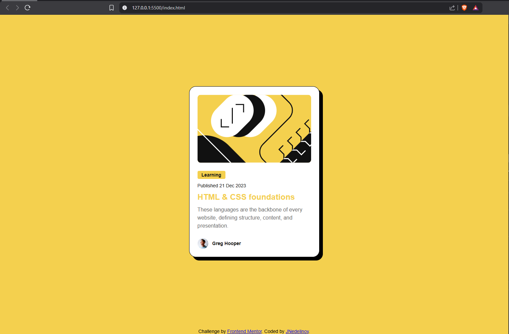
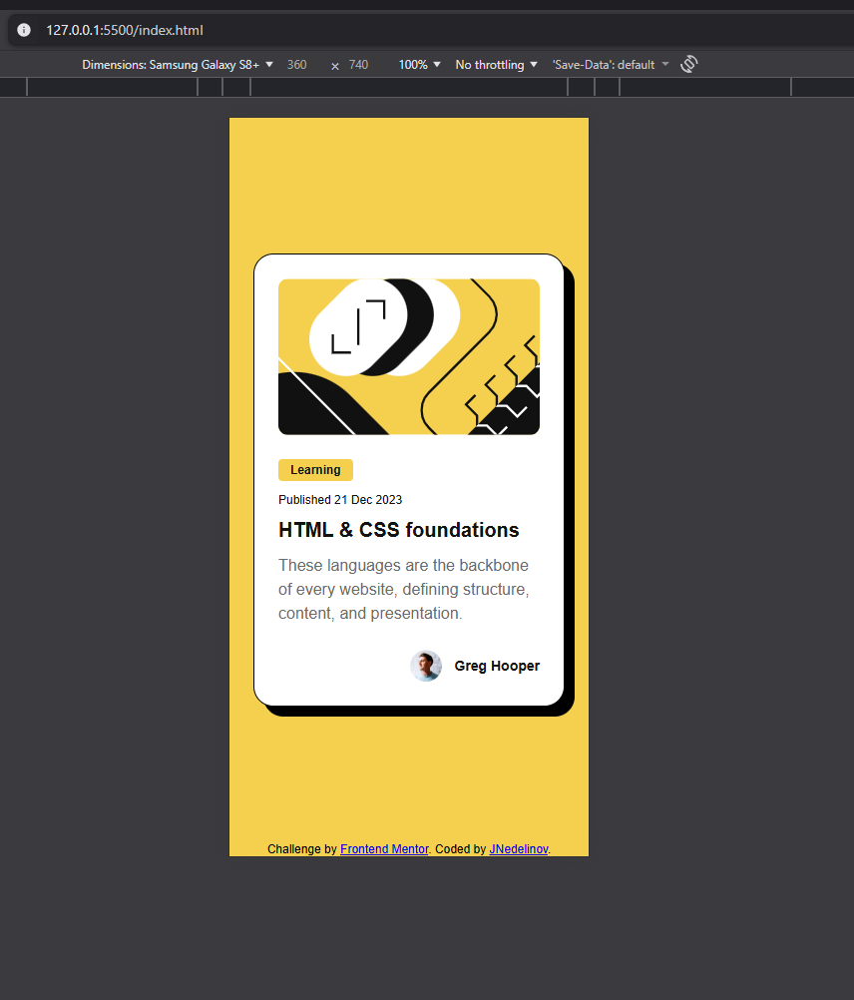

# Frontend Mentor - Blog preview card solution

This is a solution to the [Blog preview card challenge on Frontend Mentor](https://www.frontendmentor.io/challenges/blog-preview-card-ckPaj01IcS).

## Table of contents

- [Frontend Mentor - Blog preview card solution](#frontend-mentor---blog-preview-card-solution)
  - [Table of contents](#table-of-contents)
  - [Overview](#overview)
    - [Screenshot](#screenshot)
      - [Desktop Preview](#desktop-preview)
      - [Desktop Hover Preview](#desktop-hover-preview)
      - [Mobile Preview](#mobile-preview)
    - [Links](#links)
  - [My process](#my-process)
    - [Built with](#built-with)
    - [Continued development](#continued-development)
  - [Author](#author)

## Overview

### Screenshot

#### Desktop Preview

#### Desktop Hover Preview

#### Mobile Preview

### Links

- Solution URL: [GitHub repo URL here](https://github.com/JNedelinov/blog-preview-card)
- Live Site URL: [Live site URL here](https://jnedelinov-blog-preview-card.netlify.app)

## My process

### Built with

- Semantic HTML5 markup
- CSS custom properties
- Flexbox

### Continued development

I'd love to be more confident whenever I have to size different components. For example, I know that having a concrete size of an element with pixels is not of the best practices, and currently I have blockers here and I spend a lot of time thinking of solutions.

## Author

- Frontend Mentor - [@JNedelinov](https://www.frontendmentor.io/profile/JNedelinov)